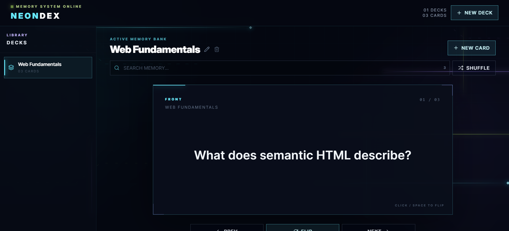

# NEONDEX — Futuristic Flashcards

NEONDEX is a single-page flashcard study application built with React, TypeScript, Tailwind CSS, Motion, and LocalStorage. It combines complete deck and card management with a dark, futuristic study-terminal interface featuring neon accents, animated light trails, circuit-style effects, and responsive motion.

## Screenshot



## Features

* Create, rename, select, and delete multiple decks
* Create, edit, and delete front/back flashcards
* Animated 3D study-card flipping
* Previous, next, flip, and Fisher-Yates shuffle controls
* Keyboard shortcuts using `Space`, `ArrowLeft`, and `ArrowRight`
* Case-insensitive search across card fronts and backs
* LocalStorage persistence for decks, cards, and the active deck
* Responsive desktop sidebar and animated mobile deck drawer
* Accessible forms, dialogs, focus states, keyboard behavior, and reduced-motion support
* Session progress indicator and card management list
* Animated neon light trails, circuit pulses, and background scanner effects
* Reduced-motion support that disables nonessential ambient animation when requested by the user's system preferences

## Technology

* React
* TypeScript
* Vite
* Tailwind CSS
* Motion for React
* Lucide React
* Browser LocalStorage

## Run Locally

With dependencies already installed:

```bash
npm run dev
```

Open the local URL shown by Vite.

## Keyboard Shortcuts

| Key          | Action               |
| ------------ | -------------------- |
| `Space`      | Flip current card    |
| `ArrowLeft`  | Previous card        |
| `ArrowRight` | Next card            |
| `Escape`     | Close an open dialog |

Study shortcuts are intentionally disabled while typing in form controls so normal keyboard input is not interrupted.

## LocalStorage

Application state is stored under a versioned LocalStorage key. The storage utility safely parses saved JSON and falls back to an empty valid state if persisted data is malformed.

A starter deck appears only when the application has never saved state before. If the user intentionally deletes all decks, the starter data is not automatically recreated.

## Project Structure

```text
src/
├── components/
│   ├── CardForm.tsx
│   ├── CardManagementList.tsx
│   ├── ConfirmDelete.tsx
│   ├── DeckForm.tsx
│   ├── DeckSidebar.tsx
│   ├── DeckToolbar.tsx
│   ├── EmptyState.tsx
│   ├── Header.tsx
│   ├── LightTrails.tsx
│   ├── Modal.tsx
│   ├── NeonButton.tsx
│   ├── SearchInput.tsx
│   ├── StudyCard.tsx
│   └── StudyControls.tsx
├── hooks/
│   └── useKeyboardShortcuts.ts
├── types/
│   └── index.ts
├── utils/
│   ├── ids.ts
│   ├── shuffle.ts
│   └── storage.ts
├── App.tsx
├── index.css
└── main.tsx
```

## AI-Assisted Development Reflection

* AI saved substantial development time by helping generate the initial component structure, CRUD functionality, LocalStorage persistence, study controls, and visual styling instead of requiring each feature to be built individually from scratch.
* One issue I reviewed closely was the study animation state. Navigating to another card while the current card was flipped could cause the next card to remain in the wrong visual state, so the navigation, deck switching, search, shuffle, and deletion behavior were adjusted to reset the flip state appropriately.
* I refactored the keyboard behavior out of the main application component into `useKeyboardShortcuts`. This made the global event listener, cleanup logic, typing guards, and keyboard controls easier to understand and maintain.
* I improved accessibility by using semantic buttons and form labels, visible focus states, keyboard-accessible controls, an accessible reusable dialog with Escape handling and focus trapping, an `aria-live` region, and reduced-motion support for the animated interface.
* I found that AI produced better results when my prompts became more specific about component structure, state behavior, LocalStorage persistence, accessibility, animation behavior, and edge cases instead of only describing the application's appearance and basic features.

